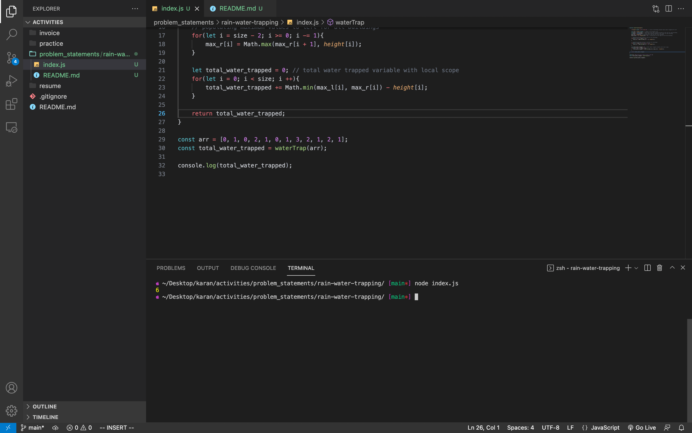

## Logic

* Basically one needs to calculate amount of water over each building and sum it.
* The water over each building will be the minimum of maximum building height to the left and maximum building height to the right minus the height of the building itself. ```min(max_to_left[i], max_to_right[i]) - height[i]```
* We will store the maximum building height to the left of each building and maximum building height to the right of each building in two separate arrays.



